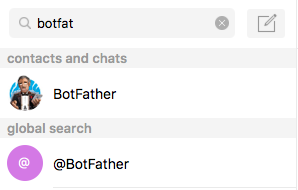

# Create your Telegram bot in python with botimize bot-analytics service

Here is our 10 min guide to create an echo-bot on telegram with [botimize](http://www.botimize.io) **bot analytic** service.

## Set up the dependency

Create a requirements.txt and copy this into it.
```
appdirs==1.4.3
botimize==1.1
certifi==2017.4.17
future==0.16.0
gunicorn==19.7.1
numpy==1.12.1
packaging==16.8
pyparsing==2.2.0
python-telegram-bot==5.3.0
requests==2.13.0
six==1.10.0
urllib3==1.20
```

Install the package by running
```
pip install -r requirements.txt
```

## Create a telegram bot and get its token with the aid of botfather

Find botfather by ...

Talk to him like this way and record your telegram token.


## Create a botimize account and a key for the project

Go to [botimize](https://dashboard.botimize.io/register) and create an account.

Create a new project by clicking new project.


See your **Your_Botimize_Api_Key** by clicking Project Setting


## Create a python bot

Create a python script (e.g. echoBot.py) and copy this into it. 

Notice your have to replace **Your_Telegram_Token** and **Your_Botimize_Api_Key**.

```py
import apiai
import json
from telegram.ext import Updater, CommandHandler, MessageHandler, Filters
from botimize import Botimize

# Declare updater & dispatcher 
telegram_bot_token = 'Your_Telegram_Token'
updater = Updater(token=telegram_bot_token)
dispatcher = updater.dispatcher

# Declare Botimize
botimize_apiKey = 'Your_Botimize_Api_Key'
botimize = Botimize(botimize_apiKey, 'telegram', {
    'apiUrl': 'https://api.getbotimize.com',
})

# Customize function
def start(bot, update):
    bot.sendMessage(chat_id=update.message.chat_id, text="I'm a bot, please talk to me!")

def resp(bot, update):
    echo_response = update.message.text
    bot.sendMessage(chat_id=update.message.chat.id, text=echo_response)
    # botimize incoming
    botimize.log_incoming(update.to_dict())
    # botimize outgoing
    outgoingLog = {
        'token': telegram_bot_token,
        'chat_id': update.message.chat.id,
        'text': echo_response
    }
    botimize.log_outgoing(outgoingLog)

# Structuralize bot (custom functions -> dispatcher)
start_handler = CommandHandler('start', start)
echo_handler = MessageHandler(Filters.text, resp)
dispatcher.add_handler(start_handler)
dispatcher.add_handler(echo_handler)

# Update to telegram platfrom
updater.start_polling()
updater.idle()
```

## Talk to your bot
Run on the terminal
```
python echoBot.py
```
Now you can talk to your bot!
I name the bot as okokdodo you can find your bot with the bot name.

